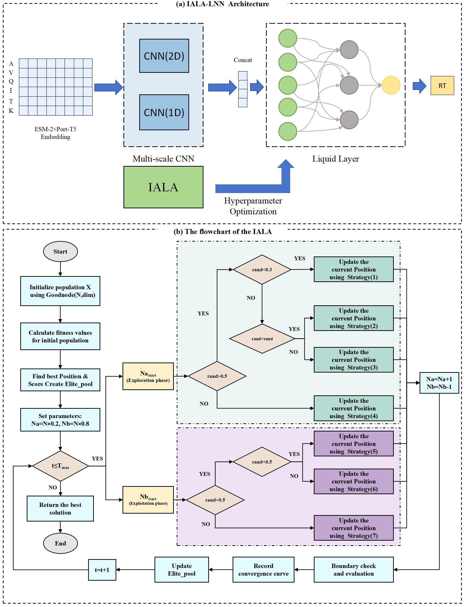

# IALA-LNN

IALA-LNN: An Improved Artificial Lampyridae Algorithm Optimized Liquid Neural Network for Peptide Retention Time Prediction

## Introduction

### Background and significance

Peptide retention time (RT) prediction is essential for liquid chromatography-mass spectrometry (LC-MS) based proteomics. Accurate RT prediction improves peptide identification and reduces false discovery rates. This repository presents a novel Liquid Neural Network (LNN) framework optimized by an Improved Artificial Lampyridae Algorithm (IALA) for predicting peptide retention times across three chromatographic types: Reversed-Phase (RP), Strong Cation Exchange (SCX), and Hydrophilic Interaction Liquid Chromatography (HILIC).

### Key innovations

1. **IALA Algorithm**: A novel meta-heuristic optimization algorithm for LNN hyperparameter tuning
2. **Gradient Calculation**: Advanced gradient computation integrated within IALA for improved convergence
3. **Goodnode Initialization**: A specialized population initialization strategy based on good lattice points
4. **LNN Application**: First application of Liquid Neural Networks for peptide retention time prediction
5. **Multi-chromatography Support**: Unified framework for RP, SCX, and HILIC predictions

### Results

Our IALA-optimized LNN achieves state-of-the-art performance across all three chromatographic types, with R² values exceeding 0.93 and significantly reduced prediction errors compared to traditional methods.

Model:  



## Repository Structure

```
├── data/
│   ├── RP.mat          # Original RP chromatography dataset
│   ├── SCX.mat         # Original SCX chromatography dataset
│   └── HILIC.mat       # Original HILIC chromatography dataset
└── main/
    ├── IALA.m          # Improved Artificial Lampyridae Algorithm
    ├── IALA_LNN.m      # Main program: IALA-optimized LNN
    ├── Goodnode.m      # Goodnode initialization method
    ├── rdata.mat       # Processed RP data (dimension-reduced)
    ├── sdata.mat       # Processed SCX data (dimension-reduced)
    ├── hdata.mat       # Processed HILIC data (dimension-reduced)
    ├── rnet.mat        # Trained model weights for RP
    ├── snet.mat        # Trained model weights for SCX
    └── hnet.mat        # Trained model weights for HILIC
```

## Requirements

- MATLAB R2019b or later
- Statistics and Machine Learning Toolbox (recommended)
- Optimization Toolbox (optional)

## Usage

### Quick Start - Using Pre-trained Models

1. Navigate to the `main/` directory
2. Open MATLAB and run:

```matlab
% Load the main program
IALA_LNN

% The program will automatically:
% - Load the appropriate dataset (rdata.mat by default)
% - Use pre-trained weights (rnet.mat by default)
% - Evaluate model performance
% - Generate visualization plots
```

### Training from Scratch

To train a new model with IALA optimization:

```matlab
% Set training mode
TYPE = 1;  % Enable IALA optimization

% Choose chromatography type by loading corresponding data
load('rdata.mat')  % For RP
% load('sdata.mat')  % For SCX
% load('hdata.mat')  % For HILIC

% Run IALA-LNN
IALA_LNN
```


